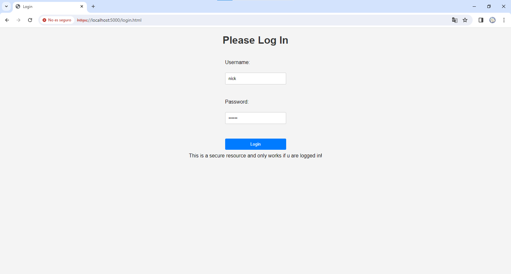
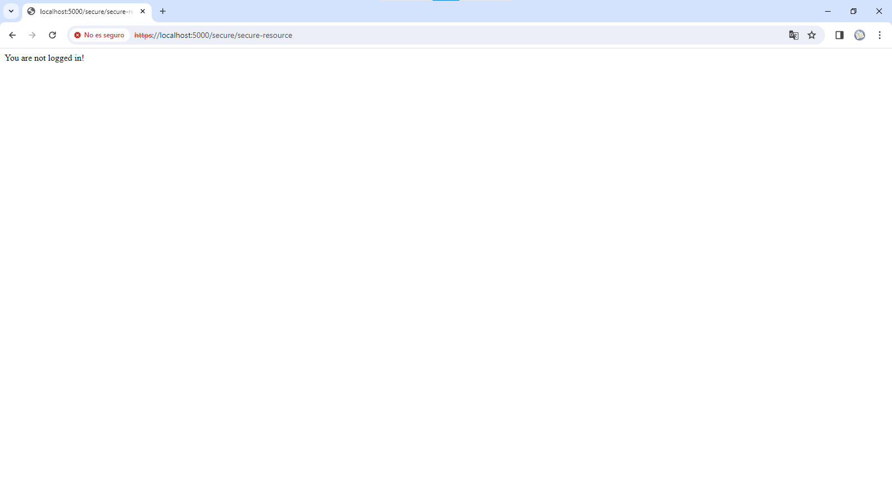
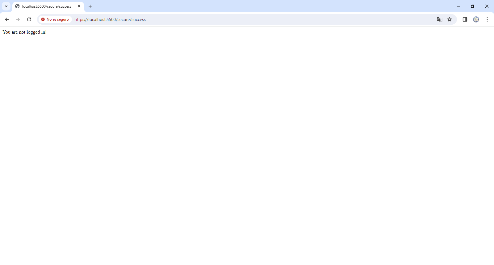

# COMUNICACIÓN SEGURA - AWS (TALLER 7 AREP)

Taller 7 del curso de Arquitecturas Empresariales (AREP) en el cual se crean diferentes componentes restringiendo su comunicación entre si a través de certificados SSL autofirmados.

## Diseño
Este proyecto cuenta con 2 componentes principales y una caracteristica de implementación

1. `Login-service` Se trata de una instancia de Spark la cual soporta un frontend desde el cual los usuarios deben autenticarse para poder tener acceso a un recurso seguro. Se comunica por medio de un certificado SSL hacia el cliente y hacia el servicio de ejemplo. 
2. `Sample-service` Componente que también funciona por Spark el cual solo responde a rutas a las cuales un cliente ya se haya autenticado. También se comunica por medio de certificados SSL.
3. `Uso de JWT` Los componentes manejan un sistema de tokens por medio de JWT mediante el cual se encargan de verficar que las solicitudes a los servicios estan protegidas para ser de uso por aquellos usuarios autorizados.

## Instrucciones de uso

### Pre-requisitos

Antes de ejecutar el servidor es necesario contar con los siguientes programas instalados y funcionando:

1. JDK (Java Development Kit)
2. MVN (Maven)

### Instalación y Ejecución - Forma local

A continuación se muestra el paso a paso de como instalar y ejecutar el servidor web

1. Clone este repositorio localmente en un entorno o carpeta de trabajo.

```
$ git clone https://github.com/NickArB/AREP-TALLER-7.git
```
2. Limpie el espacio de trabajo antes de ejecutar el proyecto con el comando.
```
$ mvn clean
```
3. A continución se deben compilar las clases del proyecto.
```
$ mvn compile
```
4. Una vez esten las clases compiladas ejecute las siguientes instrucciones de tal forma que estas queden en segundo plano.
```
$ mvn exec:java -Dexec.mainClass="edu.escuelaing.arep.LoginService" &
```
```
$ mvn exec:java -Dexec.mainClass="edu.escuelaing.arep.SampleService" &
```
5. Ahora puede verificar el funcionamiento del proyecto accediendo a la URL 
```
https://localhost:5000/
```
6. El usuario predefinido es ```nick``` y su contraseña es ```123456```. Una vez se accede con estas credenciales se va a mostrar un acceso especial al cual solo se puede obtener información al estar autenticado.


7. Si se intenta acceder con cualquier otra credencial, el sistema indicara que no se encuentra el usuario o la contraseña es errada.


8. Al intentar acceder a rutas protegidas la aplicación indicara que no se permite el acceso a este recurso.


9. Lo mismo ocurre con el acceso al servicio de ejemplo, el cual también esta protegido.


En el siguiente video se muestra una prueba donde este servicio se despliega en la nube [Link al video](https://youtu.be/MIBv6wZJykI)
## Construido con

* [Maven](https://maven.apache.org/) - Manejo de dependencias
* [AWS](https://aws.amazon.com/es/) - Proveedor de servicios de nube

## Version 1.0

## Autor

* **Nicolás Ariza Barbosa**

<!-- javadoc -d doc -sourcepath src/main/java -subpackages edu.escuelaing.app.taller -->
